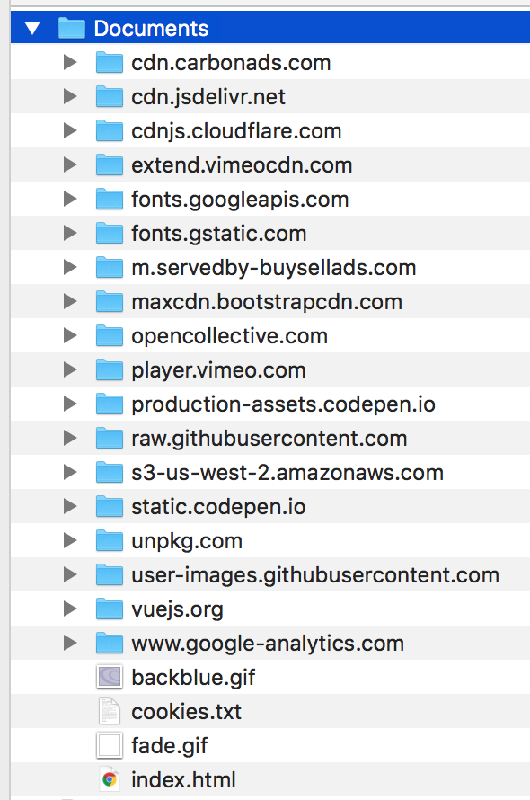
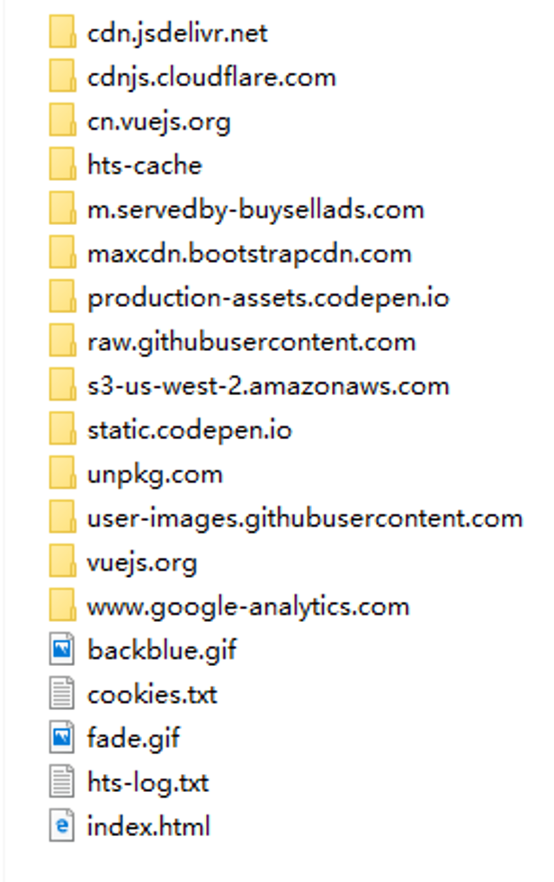
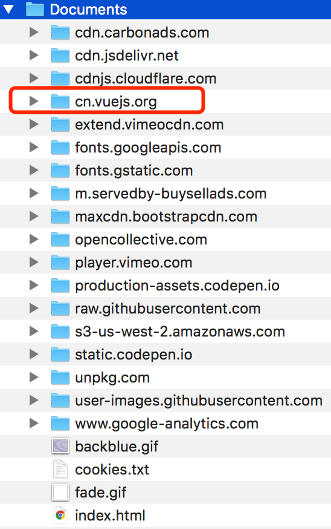
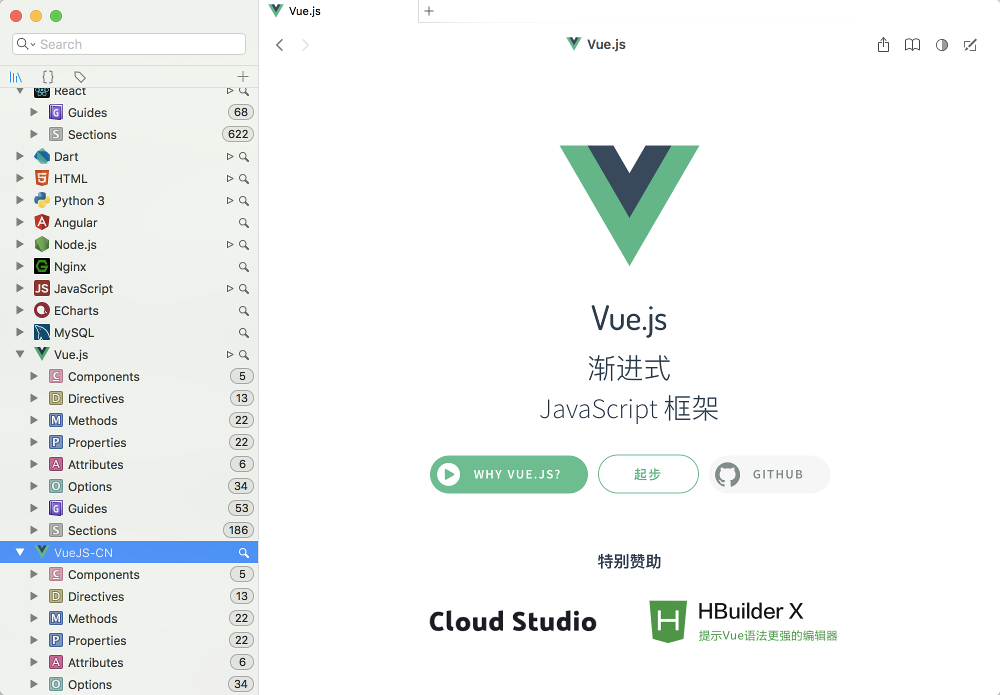
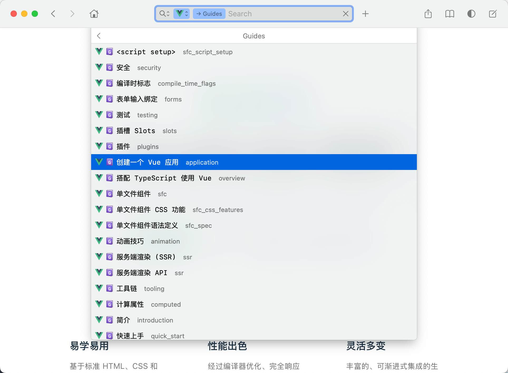
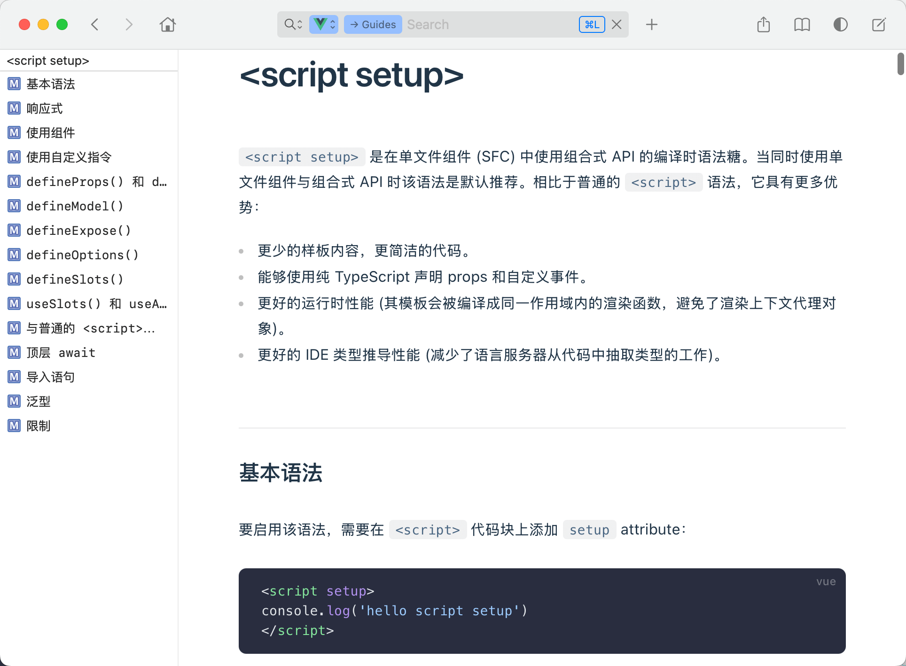
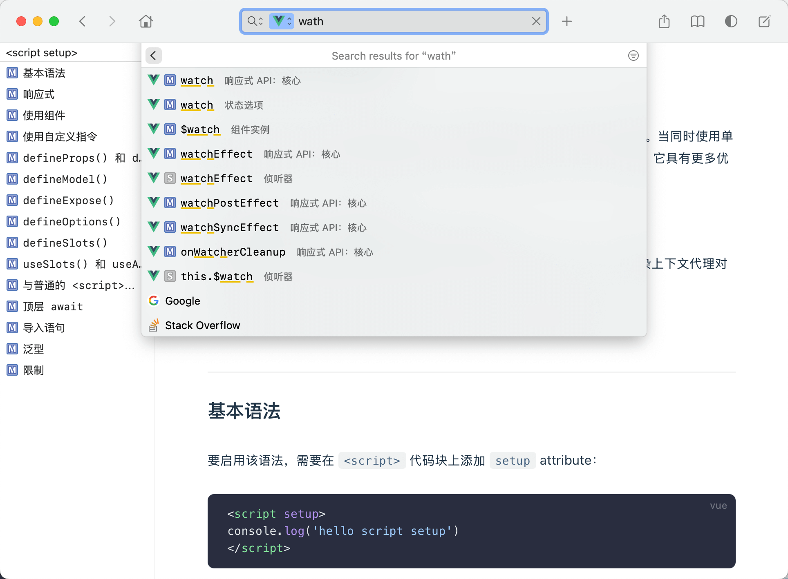

# VueJS-docset-CN
- Vue.docset  dash 文档  Vue文档中文版 
- 取自官方 https://cn.vuejs.org (Version：**2.5**)

- 持续更新
- 后续优化后提供制作过程

## 用法
 - Mac下用户下载 Dash 使用文档
 - Windows 和 Linux 用户可下载 Zeal 使用本文档

 ##  制作 docSet 文档

Dash所需的文档都是`.docSet`后缀的文件，其实docSet文件就是一个文件夹而已，里头包含最终的html文档，以及根据html建立的索引（索引放在sqlite数据库中）。

生成文档的方法有很多种，如 [Python](https://github.com/drbraden/pgdash)、[Ruby](https://github.com/Kapeli/erlang-docset/blob/master/src/generate.rb)、[Objective-C](https://github.com/Kapeli/javadocset)、[Node.js](https://github.com/exlee/d3-dash-gen)、[PHP](https://github.com/akirk/dash-phpunit)

可以选择 **镜像时处理**，也可以**镜像后处理**。只需要结果中包含html，以及sqlite 就OJBK。

这里我选择 **镜像后用NodeJS处理**

需要用到的库为：

- `fs `    做一些文件的读写操作
- `path`  路径处理
- `sync-exec`  执行一些cmd命令
- `sqlite-sync`  做一些 sqlite  操作
- `cheerio`  服务器版的jQuery


### 主要步骤：

根据官网提供的[官方文档](https://kapeli.com/docsets#dashDocset)，整个转换主要有以下5个步骤：

```
1. 创建Docset目录结构(Create the Docset Folder)；
2. 复制HTML文件(Copy the HTML Documentation)；
3. 创建Info.plist文件(Create the Info.plist File)；
4. 创建SQLite数据库文件(Create the SQLite Index)；
5. 写入SQLite数据索引(Populate the SQLite Index)；
```


### 1. 镜像站点

镜像工具有很多，这里只推荐我尝试过的几款，并且用着还不错：

| 名称           | 平台                          | 地址                                  |
| :------------- | :---------------------------- | ------------------------------------- |
| HTTrack        | OS X / Windows/Linux/Unix/BSD | http://www.httrack.com                |
| SiteSucker     | OS X                          | http://sitesucker.us/home.html        |
| Cyotek WebCopy | Windows                       | https://www.cyotek.com/cyotek-webcopy |

实际上这几种都不是很完美，或多或少会漏一些外部站点的资源文件，目前还没找到解决办法，

如果你们有解决办法，麻烦**@**我一下。

我这里以**SiteSucker** 为例，镜像 `https://cn.vuejs.org`   ，一级目录结构如下：

```
// cn.vuejs.org
├── _00.txt
├── _downloads.html
├── coc
├── css
├── fonts
├── guide
├── images
├── index.html
├── js
├── manifest.json
├── support-vuejs
└── v2
```

重点关注对象为以下，提取其中的内容，生成索引

- `cn.vuejs.org/v2/api/index.html`  (API 列表)
- `cn.vuejs.org/v2/guide/*`   (官网教程列表)
- `cn.vuejs.org/v2/style-guide/index.html`   (风格指南)


参考Dash的Vue文档，一层层拨开后，发现官方用的**HTTrack**做的镜像，并且资源文件比我自己用**HTTrack**镜像下来的资源齐全，一番折腾下来，也没成功。

对比后选择用官方的外部资源，文档内容则用自己镜像的

<div>
	
	
    
</div>

- 左侧为dash官方文档中的资源 、中间为合并后的资源（后面要用到）、 右侧为自己镜像的资源

### 2. 创建Docset目录结构(Create the Docset Folder)

  本例中我们创建的文档叫 VueJS，所以按下列结构创建目录：

```
mkdir -p VueJS.docset/Contents/Resources/Documents/
```


### 3.复制HTML文件(Copy the HTML Documentation)

​    把所有的html文档拷贝到Documents文件夹中，dash默认 Documents 为文档根目录

​    为了省事，我把需要的资源文件放在了当前项目下。    	

```
cp -r  ./Documents  VueJS.docset/Contents/Resources/
```

​    

### 4.创建Info.plist文件(Create the Info.plist File)

  在 VueJS.docset/Contents/  中创建Info.plist文件，注意文件名的大小写，文件内容如下：

```
<?xml version="1.0" encoding="UTF-8"?>
<!DOCTYPE plist PUBLIC "-//Apple//DTD PLIST 1.0//EN" "http://www.apple.com/DTDs/PropertyList-1.0.dtd">
    <plist version="1.0">
    <dict>
        <key>CFBundleIdentifier</key>
        <string>VueJS</string>
        <key>CFBundleName</key>
        <string>VueJS-CN</string>
        <key>DocSetPlatformFamily</key>
        <string>VueJS</string>
        <key>isDashDocset</key>
        <true/>
        <key>DashDocSetFamily</key>
        <string>dashtoc3</string>
        <key>dashIndexFilePath</key>
        <string>cn.vuejs.org/index.html</string>
    </dict>
    </plist>
```

一个xml文件，里面都是成对的key-string配置项

- `dashIndexFilePath`  表示在Dash中点击你的文档后，默认的主页是什么
- `CFBundleName` 为在dash 中的文档名称
- `DashDocSetFamily`  左下角显示索引列表 (这里我有配置，但是没生效，后续再研究)
- 其他部分为一些关键字


### 5.创建SQLite数据库文件(Create the SQLite Index)

1. 创建sqlite索引。

   索引文件的位置是：VueJS.docset/Contents/Resources/docSet.dsidx ，（Mac电脑已经预装了sqlite）

   所以直接从命令行进入Resources文件夹，在命令行中敲：

   ```
   sqlite3 docSet.dsidx 
   ```

2. 这样就进入了sqlite数据库，接下来，创建数据表

   ```
   CREATE TABLE searchIndex(id INTEGER PRIMARY KEY, name TEXT, type TEXT, path TEXT)
   ```


### 6.写入SQLite数据索引(Populate the SQLite Index)；


再往后就是，从html文件中提取内容，插入索引。这是最重要的一点，这里没弄好，整个都没啥用。

```
INSERT OR IGNORE INTO searchIndex(name, type, path) VALUES ('name', 'type', 'path');
```

其中

- `name` 为关键字，比如你想在dash中输入一个select就可以查询，那这个select就是关键字；
- `type ` 为关键字的类型，官方支持的有很多，如Class、Function、Guide、Method等；
- `path` 为文档的锚点地址，点击目录跳转

官方原文为：

> - `name` is the name of the entry. For example, if you are adding a class, it would be the name of the class. This is the column that Dash searches.
> - `type` is the type of the entry. For example, if you are adding a class, it would be "Class". For a list of types that Dash recognises, see below.
> - `path` is the relative path towards the documentation file you want Dash to display for this entry. It can contain an anchor (#). Alternatively, Dash also supports `http://` URL entries.

以下为我的部分代码，完整的代码在  build-vue.js

```
// build-vue.js

/**
 * 根据各个标题处理相应的锚点 添加索引
 *
 * @param $ dom 对象
 * @param relativePath 相对路径
 * @param dir 文件夹名称
 */
function handleTitles($,relativePath,dir) {
    // 教程模块 以h2 为索引，需要添加一个h1 的索引
    let h1Title = '';
    if(dir === 'guide'){
        $('h1').each(function (i,h) {
            h1Title = Array.from(h.childNodes).map((node) => node.data ).join('');
            db.run(`INSERT INTO searchIndex (name, type, path) VALUES ('${h1Title}', '${type['guide']}', '${relativePath}')`,function(res){
                if(res.error) throw res.error;
                console.log(res);
            });
        });
    }
    $('h2').each(function (i,h) {
        if(!h.attribs.id) return;
        let h2s = extractText(h); // 提取标题中的ID、文本内容
        let h3s = [];
        if(dir === 'api'){
            h3s = collectH3s(h);
            if(h3s.length<1) return
        }
        let entryType = type[h2s.id] || type['h2'];  // 默认 Section
        console.log(h2s);
        let h2Num = dir === 'api' ? 1 : 0;
        let h2Type = type['h2'];  // h2 归类为 Section
        addDashAnchor(h,h2s.id,h2Type,h2Num);
        let inTitle = `${h2s.text} ${dir === 'guide' ? ' - '+ h1Title : ''}`;
        let iniType =  dir ==='api' ? type['guide'] : h2Type;
        db.run(`INSERT INTO searchIndex (name, type, path) VALUES ('${inTitle}', '${iniType}', '${relativePath}#${encodeURIComponent(h2s.id)}')`,function(res){
            if(res.error) throw res.error;
            console.log(res);
        });
        // api下 需要处理 h3 标题，生成相应的索引
        if(dir === 'api'){
            h3s.forEach(function (titleNode,index) {
                let id =  titleNode.attribs.id;
                let text = [].slice.call(titleNode.childNodes).map( (node) => node.data).join('');
                // 需要处理括号
                if(text.match(/^([^(]+)\(/)) text= text.match(/^([^(]+)\(/)[1];
                console.log(id,text,entryType);
                addDashAnchor(titleNode,id,entryType,0);
                db.run(`INSERT INTO searchIndex (name, type, path) VALUES ('${text}', '${entryType}', '${relativePath}#${encodeURIComponent(id)}')`,function(res){
                    if(res.error) throw res.error;
                    console.log(res);
                });
            });
        }
    });

    /**
     *  提取标题中的ID、文本内容
     * @param h node
     * @returns {{id: *, text: *}}   id 用来生成锚点、text当做标题
     */
    function extractText (h) {
        let title =  [].slice.call(h.childNodes).map( (node) => node.tagName === 'a' ?  node.attribs.title : '').join('');
        let id = h.attribs.id;
        return {
            id: id,
            text:  title ? htmlEscape(title) : id // 如果没有就用ID 代替
        }
    }

    // 字符转义
    function htmlEscape (text) {
        return text
            .replace(/&amp;/g, '&')
            .replace(/&quot;/g, '"')
            .replace(/&#39;/g, `'`)
            .replace(/&lt;/g, '<')
            .replace(/&gt;/g, '>')
    }
    // 提取h2 附近的h3 标题列表
    function collectH3s (h) {
        let h3s = [];
        let next = h.nextSibling;
        while (next && next.tagName !== 'h2') {
            if (next.tagName === 'h3') {
                next.childNodes = removeTagA(next);
                h3s.push(next)
            }
            next = next.nextSibling
        }
        return h3s
    }
    // 移除A标签
    function removeTagA(h) {
       return [].slice.call(h.childNodes).filter(function (node) {
            return node.tagName !== 'a'
        })
    }
    // 添加dash规定格式的 锚点
    function addDashAnchor(h,name,types,num) {
        let nameStr = (`//dash_ref_${name}/${types}/${encodeURIComponent(name)}/${num}`); // 需要对URL 进行URL编码（百分比转义）
        let dashAnchor = `<a class="dashAnchor" name="${nameStr}"/>`;
        h.childNodes = removeTagA(h); // 取完title之后移除原有的锚点，添加 dash规定格式的锚点
        $(h).before(dashAnchor).html();
    }
}

```


### 7. 导入文档

把所有的索引数据都插入到**searchIndex**以后，docSet文档就制作好了，直接双击 **VueJS.docSet**就可以导入Dash了。


## 截图










